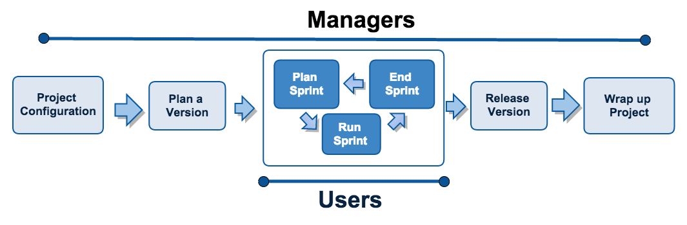
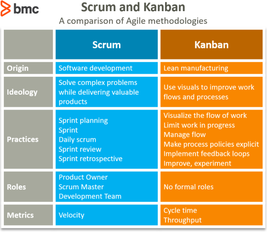

Que. What is jira?

Ans. Project management tool
    - Track project work status.
    - Track Bug and issues.
    - Team work and time tracking.
    - etc..

Que. Why Need of Jira?

Ans. - one step solution for project management.
     - no need to make excel and other doccumemnts.
     - project work and bugs can manage easily.
     - Team can communicate over the project.
     - Multiple projects can handle.
     - Charts and graphs will help the project progress.

Que. History and details about jira.

Ans. - Jira is developed by Atlassian.
     - bitbucket, jira and confluence are developed by Atlassian.
     - jira Products:
       a). Jira Work Management
       b). Jira Software
       c). Jira Service Management

Que. How jira works?

    

 Que. Jira Instance?

Ans. - Cloud instance
     - Server instance

        Cloud instance: 
          - setup jira on atlassian.com(jira cloud only).
          - No server cost and no security code.
          - No need to update time to time.
          - Best for learning.
        Server instance:
          - setup jira software on your server.
          - eg. jira.yourdomain.com
          - need to manage and update time to time.
          - if your have big team and big project then must use server instance.

  

    Que. Agile Methodology?
  

  Ans. It is a way to manage a project by breaking it up into sevarl phases.
  examples:
    - make a plan for 15 days.
    - development for plan
    - test project according to the plan.
    - make feedback from the customer.
    - start next plan.

  

    Que. Agile Principles?
  

  Ans. there are 12 principles
    - satisfy the customer.
    - welcome changing requirements.
    - deliver working software frequently.
    - bussiness works with developers daily.
    - builds project around motivated individuals.
    - face-to-face conversation best.
    - working software matters.
    - constant pace.
    - high quality code is faster.
    - maximize work not done.
    - self-organizing teams deliver quality.
    - feedback loops used to improve.

    # Agile Alternatives
     - waterfall methodology.
     - rapid development.
     - lean etc.

  

    Que. Scrum?
  

  Ans. - scrum is a framework of agile methodoloy.
       - helps teams structure and manage their work through a set of values.

       Basic rules of scrum.
        - Every sprint is four weeks or less duration.
        - there are no breaks between sprints.
        - the intention of every sprint is "potentially shippable" software.
        - everry sprint include sprint review for stakeholder feedback on the product.
      
      Roles in scrum:
        - product owner.
        - scrum master.
        - development team members.

  

    Que. scrum vs kanban
  

    Ans. 

  

    Que. what is sprint? 
  

  Ans. A sprint is short, time-boxed period when a scrum team works to complete a set of amount of work.
      sprint duration should be less than 4 weeks. 

