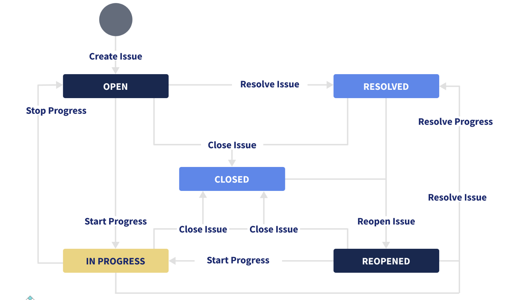

Que.1 - Explain the workflow of Jira.

Ans. Since Jira is used to track the issue and transitions in the development life cycle of the software, 
    the workflow is like a set of software-related activities which help in performing these operations. 
    The link between these 2 states is called a transition. The issue moves from one transition state to another state. 
    The status is used to define the nature of the work that is completed by the tester.
     
    In the JIRA workflow, the important phases that occur are given below: 
    - To Do  
    - In progress  
    - Finally done 
     
    

Que.2 - What are some of the benefits of using Jira?

Ans. The following are some of the benefits of using Jira:
<ul>
    <li>
        It is easily customizable and extensible.
    </li>
    <li>
        It runs almost anywhere as it is platform-independent. It is recognized by quite a few well-known companies.
    </li>
    <li>
        We can get the latest update on the progress of projects via Jira.
    </li>
    <li>
        It has an upfront and fair licensing policy.
    </li>
</ul>

